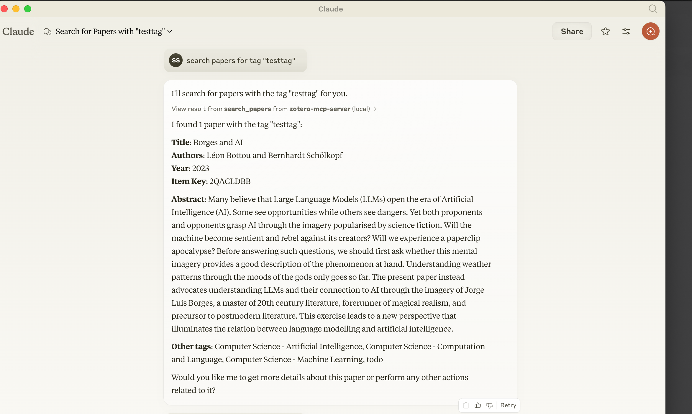

# Zotero MCP Server

A MCP (Model Context Protocol) server to let your MCP clients (e.g. Anthropic Claude App, Goose, possibly vscode Cline too) interact with your local Zotero repository. This server enables programmatic access to your Zotero library, allowing you to search papers, manage notes, and more.

## Setup

1. Install dependencies:
```bash
pip install -e .
```

2. Create a `.env` file in the root directory with your Zotero credentials:
```bash
ZOTERO_API_KEY=your_api_key_here
ZOTERO_USER_ID=your_user_id_here
```

You can get your Zotero API key and user ID from [Zotero's settings page](https://www.zotero.org/settings/keys).

## Integration with Anthropic Desktop App

To integrate with the Anthropic Desktop app, add the following configuration to `~/Library/Application Support/Claude/claude_desktop_config.json`:

```json
{
  "mcpServers": {
    "zotero-mcp-server": {
      "command": "uv",
      "args": [
        "--directory",
        "/Users/swairshah/work/research/zotero-mcp",
        "run",
        "python",
        "-m",
        "zotero_mcp.server"
      ]
    }
  }
}
```

## Example Usage



The server allows you to:
- Search papers by tags
- Get paper details and attached notes
- Add notes to papers
- Request paper summaries
